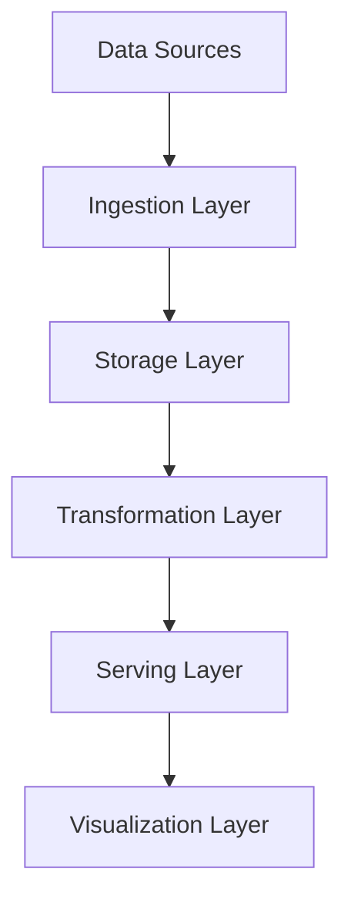
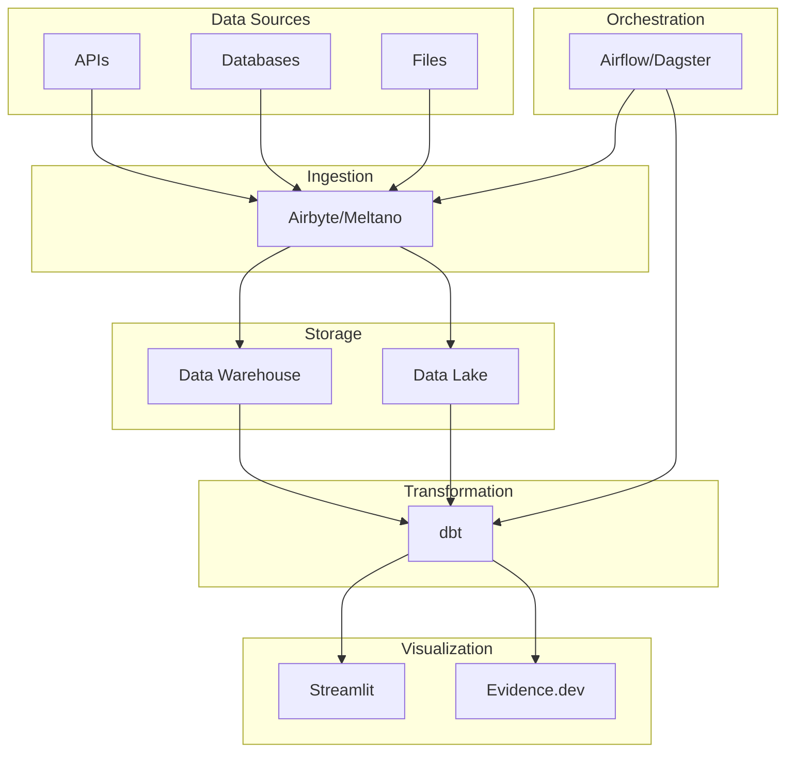
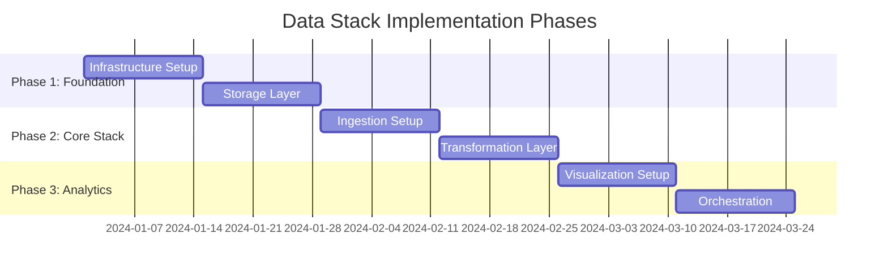

# Create Modern Data Stack Planning (Parallel Research)

Transform rough data stack ideas into comprehensive architecture plans using parallel research agents for maximum efficiency and depth.

## Modern Data Stack Idea: $ARGUMENTS

## Phase 1: Parallel Research Discovery

**IMPORTANT**: Execute the following 4 research agents simultaneously using multiple Agent tool calls in a single response to maximize research efficiency.

### Research Agent Coordination

Launch these agents concurrently - do not wait for one to complete before starting the next:

#### Agent 1: Modern Data Stack Landscape
```
Task: Data Stack Market Analysis
Prompt: Research the modern data stack landscape for "$ARGUMENTS". Conduct deep analysis of:
- Current open source data stack components (ingestion, transformation, storage, orchestration, visualization)
- Popular tool combinations and their adoption rates
- Cost-benefit analysis of open source vs proprietary solutions
- Community size, support, and long-term viability of tools
- Integration patterns between different data stack layers
- Target user segments (data engineers, analysts, data scientists, business users)

Focus purely on research - do not write any code. Use web search extensively. Return a comprehensive data stack landscape report with specific tool recommendations and ecosystem insights.
```

#### Agent 2: Technical Architecture & Implementation
```
Task: Data Stack Technical Research
Prompt: Analyze technical implementation patterns for "$ARGUMENTS". Research and evaluate:
- Recommended open source technology stacks (dbt, Airflow, Dagster, Meltano, etc.)
- Container orchestration patterns (Docker Compose, Kubernetes) for data stacks
- Data warehouse/lakehouse architectures (DuckDB, ClickHouse, PostgreSQL, MinIO)
- CI/CD patterns for data pipelines and infrastructure
- Monitoring, logging, and observability for data systems
- Development effort estimation for different stack configurations

Focus on research only - no code implementation. Use web search for current best practices. Return technical recommendations with pros/cons analysis for each component.
```

#### Agent 3: Developer Experience & Operations
```
Task: Data Stack UX Research
Prompt: Research developer and user experience patterns for "$ARGUMENTS". Investigate:
- Developer workflow patterns for modern data stacks
- CLI tools and interfaces for data stack management
- Dashboard and visualization best practices (Streamlit, Grafana, Evidence.dev)
- Data catalog and discovery user experiences
- Debugging and troubleshooting workflows
- Onboarding and documentation patterns for data teams

Research only - no design creation. Use web search for UX case studies from data platform teams. Return UX analysis with actionable recommendations for developer productivity.
```

#### Agent 4: Data Governance & Best Practices
```
Task: Data Stack Governance Research
Prompt: Research data governance and operational best practices for "$ARGUMENTS". Cover:
- Data quality and validation frameworks
- Security patterns for containerized data environments
- Data lineage and metadata management approaches
- Testing strategies for data pipelines and transformations
- Deployment and rollback strategies for data infrastructure
- Cost optimization patterns for open source data stacks

Research focus only. Use web search for data governance guides. Return comprehensive best practices guide with specific implementation patterns.
```

## Phase 2: Research Synthesis & Analysis

Once all agents complete their research, synthesize the findings into:

### Data Stack Component Assessment
- Recommended open source tools for each layer (ingestion, transformation, storage, orchestration, visualization)
- Integration patterns and compatibility matrix
- Community support and long-term viability analysis
- Cost-benefit analysis vs proprietary alternatives

### Technical Architecture Framework
- Containerized data stack architecture design
- Data flow and processing patterns
- Storage and compute separation strategies
- Monitoring, logging, and observability stack

### Developer Experience Blueprint
- CLI and interface design patterns
- Data development workflow optimization
- Testing and validation frameworks
- Documentation and onboarding strategies

### Operational Readiness
- Data governance and quality frameworks
- Security patterns for containerized environments
- Performance benchmarks and optimization strategies
- Deployment, scaling, and maintenance procedures

## Phase 3: User Validation & Requirements Gathering

### Critical Questions for User
Before generating the final Data Stack Architecture Plan, ask the user to clarify:

1. **Data Stack Scope & Constraints**
   - What's the target implementation timeline?
   - Infrastructure budget or resource constraints?
   - Must-have vs nice-to-have data stack components?
   - Data volume and processing requirements?

2. **Success Definition**
   - Primary data stack success metrics (performance, reliability, cost)?
   - User adoption goals across data team roles?
   - Business objectives for data infrastructure?
   - Data quality and governance requirements?

3. **Technical Context**
   - Existing data sources and systems to integrate?
   - Cloud provider preferences or restrictions?
   - Team expertise in data engineering, analytics, and DevOps?
   - Compliance or security requirements?

4. **User Context**
   - Primary user personas (data engineers, analysts, scientists, business users)?
   - Use case priorities (analytics, ML, reporting, real-time processing)?
   - Current data infrastructure pain points?
   - Preferred development and deployment workflows?

## Phase 4: Data Stack Architecture Plan Generation

Using the synthesized research and user input, create a comprehensive Data Stack Architecture Plan following this structure:

### Data Stack Architecture Plan Template
```markdown
# Modern Data Stack Architecture Plan: [Stack Name]

## 1. Executive Summary
- Data infrastructure problem statement
- Proposed open source data stack solution
- Success criteria and business value
- Resource and timeline requirements

## 2. Data Stack Landscape Analysis
[Insert Data Stack Market Analysis Agent findings]
- Open source tool ecosystem overview
- Recommended component combinations
- Community support and tool viability
- Cost analysis vs proprietary solutions

## 3. Developer Experience Design
[Insert Developer Experience Agent findings]
- Data team user personas and workflows
- CLI and interface requirements
- Development and debugging workflows (with Mermaid diagrams)
- Documentation and onboarding strategies

## 4. Technical Architecture
[Insert Technical Implementation Agent findings]
- Data stack architecture (with Mermaid diagrams)
- Component integration patterns
- Container orchestration approach
- Monitoring and observability stack

## 5. Data Governance & Operations
[Insert Data Governance Agent findings]
- Data quality and validation frameworks
- Security patterns for containerized environments
- Deployment and scaling strategies
- Cost optimization approaches

## 6. Implementation Roadmap
- Data stack deployment phases
- Component dependencies and prerequisites
- Timeline estimates and milestones
- Resource allocation and team requirements

## 7. Success Metrics & KPIs
- Data pipeline performance indicators
- Data quality and reliability metrics
- Developer productivity measurements
- Cost efficiency targets

## 8. Risk Assessment
- Technical risks and mitigation strategies
- Vendor lock-in and tool replacement risks
- Scaling and performance risks
- Team adoption and training risks
```

### Required Diagrams (using Mermaid)
Generate these diagrams in the Data Stack Architecture Plan:

1. **Data Flow Diagram**


2. **Data Stack Architecture Diagram**


3. **Implementation Timeline**


## Phase 5: Save and Handoff

Save the completed Data Stack Architecture Plan as: `data-stack-plans/{sanitized-stack-name}-architecture-plan.md`

### Quality Checklist
Before marking complete, verify:
- [ ] All 4 research areas covered comprehensively
- [ ] User validation questions answered
- [ ] Data stack architecture clearly defined
- [ ] Data flow diagrams created with Mermaid
- [ ] Implementation phases outlined
- [ ] Success metrics and KPIs defined
- [ ] Data governance requirements documented
- [ ] Ready for implementation and Docker Compose setup

### Next Steps
1. Review architecture plan with data team stakeholders
2. Create Docker Compose configuration for the stack
3. Set up CI/CD pipelines for data infrastructure
4. Begin component-by-component implementation
5. Create monitoring and alerting setup

---

**Remember**: This command leverages parallel research agents to create comprehensive data stack architecture plans 4x faster than sequential research. The quality depends on thorough agent coordination and synthesis of findings focused on modern open source data tools and patterns.
