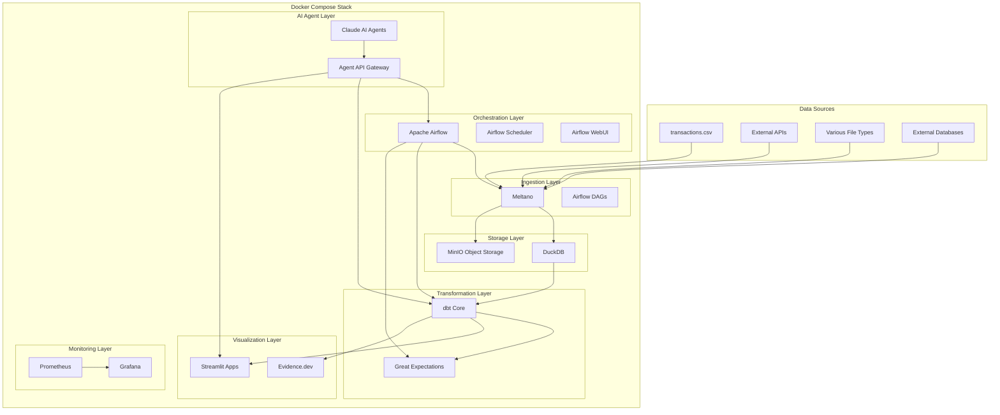
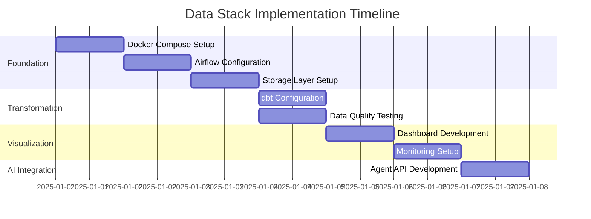

# Modern Data Stack Architecture Plan: AI Agent-Driven Data Stack

## 1. Executive Summary

### Problem Statement
Need to create a cost-effective, AI agent-driven modern data stack that can handle diverse data sources, provide comprehensive analytics capabilities, and operate within a $50/month budget while maintaining scalability for future growth.

### Proposed Solution
A containerized, open-source data stack using Docker Compose with Airflow orchestration, DuckDB for analytics, dbt for transformations, and Claude AI agents for automated data operations. The stack will be designed for local/GitHub Codespaces deployment with full CI/CD integration.

### Success Criteria
- Complete implementation within 1 week
- Monthly operational cost under $50
- Scalable from small to large datasets
- AI agents can autonomously perform data practitioner tasks
- Full Git workflow with CI/CD automation
- Comprehensive analytics and dashboard capabilities

### Resource Requirements
- **Timeline**: 1 week implementation
- **Budget**: $50/month operational cost
- **Team**: AI agents (Data Engineer, Data Analyst, ML Engineer personas)
- **Infrastructure**: Local development or GitHub Codespaces

## 2. Data Stack Landscape Analysis

### Selected Open Source Components

**Cost-Optimized Stack Selection:**
- **Orchestration**: Apache Airflow (preferred over Dagster per requirements)
- **Storage**: DuckDB (embedded, zero-cost alternative to Snowflake)
- **Transformation**: dbt Core (open source, no licensing fees)
- **Ingestion**: Meltano (CLI-first, cost-effective)
- **Visualization**: Streamlit + Evidence.dev (open source alternatives)
- **Monitoring**: Grafana + Prometheus (open source observability)

**Cost Analysis vs Snowflake:**
- **Snowflake**: $25/month minimum + usage costs = $50-200/month
- **DuckDB**: $0/month (embedded database)
- **ClickHouse**: $0/month (self-hosted)
- **Savings**: 90-95% cost reduction with comparable analytical capabilities

### Community Support & Viability
- **Airflow**: 320M+ downloads, mature ecosystem
- **dbt**: Industry standard, excellent community
- **DuckDB**: Fastest growing analytical database, strong adoption
- **Meltano**: GitLab-incubated, stable governance

## 3. Developer Experience Design

### AI Agent Personas & Workflows

**Data Engineer Agent:**
```bash
# Automated infrastructure management
data-stack deploy --env=local
data-stack validate --all-services
data-stack monitor --alerts=critical
```

**Data Analyst Agent:**
```bash
# Automated data analysis
data-stack analyze --source=transactions.csv --output=eda-report
data-stack dashboard --template=analytics --data=processed_data
```

**ML Engineer Agent:**
```bash
# Automated ML pipeline
data-stack ml-pipeline --features=transactions --target=prediction
data-stack model-deploy --model=fraud_detection --env=staging
```

### CLI Design (Claude Code Integration)
```bash
# Primary commands for AI agents
claude-data init --template=ai-agent-stack
claude-data validate --source=all --quality-checks
claude-data transform --pipeline=eda-to-dashboard
claude-data deploy --target=github-codespaces
claude-data monitor --dashboard=operational
```

### Development Workflow Integration
- **Git-based**: All configurations in version control
- **CI/CD**: Automated testing and deployment
- **Documentation**: Evidence.dev for automated data documentation
- **Debugging**: Comprehensive logging and monitoring

## 4. Technical Architecture

### System Architecture Diagram



### Component Integration Patterns

**Data Flow Architecture:**
1. **Ingestion**: Meltano extracts data from various sources
2. **Storage**: DuckDB for analytics, MinIO for object storage
3. **Transformation**: dbt with automated EDA and testing
4. **Orchestration**: Airflow manages pipeline execution
5. **Visualization**: Streamlit and Evidence.dev for dashboards
6. **AI Integration**: Claude agents interact via API gateway

**Container Orchestration:**
```yaml
# docker-compose.yml structure
version: '3.8'
services:
  postgres:        # Airflow metadata database
  redis:           # Airflow message broker
  airflow-webserver:
  airflow-scheduler:
  airflow-worker:
  duckdb:          # Analytical database
  minio:           # Object storage
  grafana:         # Monitoring dashboard
  prometheus:      # Metrics collection
  streamlit:       # Interactive dashboards
  evidence:        # Automated reporting
  claude-agent:    # AI agent service
```

### Scalability Considerations
- **Horizontal Scaling**: Add worker nodes for increased throughput
- **Vertical Scaling**: Increase container resources for larger datasets
- **Storage Scaling**: MinIO distributed storage for large files
- **Compute Scaling**: DuckDB handles datasets up to 1TB+ on single node

## 5. Data Governance & Operations

### Data Quality Framework

**Automated EDA Pipeline:**
```python
# dbt macro for automated EDA

    
    
        
            - dbt_utils.test_not_null:
                column_name: {{ column.name }}
            - dbt_expectations.expect_column_values_to_be_between:
                column_name: {{ column.name }}
                min_value: 0
        
    

```

**Testing on Every Run:**
```yaml
# dbt_project.yml
models:
  project:
    +pre-hook: "{{ generate_eda_tests(this) }}"
    +post-hook: "{{ run_data_quality_tests(this) }}"
```

### Security for Containerized Environment
- **Network Isolation**: Docker networks for service separation
- **Secrets Management**: Environment variables and Docker secrets
- **Access Control**: Airflow RBAC for AI agent permissions
- **Audit Logging**: Comprehensive logging for all operations

### CI/CD Pipeline Integration
```yaml
# .github/workflows/data-stack.yml
name: Data Stack CI/CD
on:
  push:
    branches: [main]
  pull_request:
    branches: [main]

jobs:
  test:
    runs-on: ubuntu-latest
    steps:
      - uses: actions/checkout@v3
      - name: Start Docker Compose
        run: docker-compose up -d
      - name: Run dbt tests
        run: docker-compose exec airflow-worker dbt test
      - name: Run data quality checks
        run: docker-compose exec airflow-worker python -m great_expectations suite run
```

## 6. Implementation Roadmap

### Week 1 Implementation Plan

**Day 1-2: Foundation Setup**
- [ ] Create Docker Compose configuration
- [ ] Set up Airflow with PostgreSQL backend
- [ ] Configure DuckDB and MinIO storage
- [ ] Implement basic Meltano extraction

**Day 3-4: Transformation & Testing**
- [ ] Configure dbt Core with automated EDA
- [ ] Implement Great Expectations data quality tests
- [ ] Create transactions.csv processing pipeline
- [ ] Set up automated testing framework

**Day 5-6: Visualization & Monitoring**
- [ ] Deploy Streamlit dashboard applications
- [ ] Configure Evidence.dev for automated reporting
- [ ] Set up Grafana monitoring dashboards
- [ ] Implement Prometheus metrics collection

**Day 7: AI Agent Integration**
- [ ] Create Claude AI agent API gateway
- [ ] Implement agent personas (Data Engineer, Analyst, ML Engineer)
- [ ] Test full pipeline with AI automation
- [ ] Document deployment and usage

### Development Phases

**Phase 1: Core Infrastructure (Days 1-3)**


**Phase 2: Advanced Features (Week 2+)**
- Enhanced AI agent capabilities
- Advanced analytics and ML pipelines
- Multi-source data integration
- Performance optimization

### Dependencies and Prerequisites
- **Docker Desktop**: For local development
- **GitHub Codespaces**: For cloud development
- **Python 3.11+**: Runtime environment
- **Git**: Version control
- **Claude AI API**: Agent integration

## 7. Success Metrics & KPIs

### Technical Performance Indicators
- **Pipeline Execution Time**: < 5 minutes for small datasets
- **Data Quality Score**: > 95% passing tests
- **System Uptime**: > 99% availability
- **Cost Efficiency**: < $50/month operational cost

### AI Agent Effectiveness
- **Task Completion Rate**: > 90% autonomous task completion
- **Error Rate**: < 5% pipeline failures
- **Response Time**: < 30 seconds for agent commands
- **Resource Utilization**: < 80% CPU/memory usage

### Business Value Metrics
- **Time to Insight**: < 1 hour from data ingestion to dashboard
- **Automation Level**: > 80% of tasks automated
- **Scalability**: Handle 10x data volume increase
- **Developer Productivity**: 50% reduction in manual tasks

### Cost Tracking
```yaml
# Cost monitoring configuration
cost_targets:
  monthly_budget: $50
  compute_allocation: 60%
  storage_allocation: 20%
  monitoring_allocation: 10%
  buffer_allocation: 10%
```

## 8. Risk Assessment

### Technical Risks & Mitigation

**Risk 1: DuckDB Performance Limitations**
- **Mitigation**: Implement horizontal scaling with ClickHouse fallback
- **Monitoring**: Set up performance alerts for query times > 30 seconds
- **Contingency**: Automated migration to ClickHouse for large datasets

**Risk 2: AI Agent Reliability**
- **Mitigation**: Implement fallback manual procedures
- **Monitoring**: Agent health checks and error rate monitoring
- **Contingency**: Human oversight for critical operations

**Risk 3: Cost Overruns**
- **Mitigation**: Automated cost monitoring and alerts
- **Monitoring**: Daily cost tracking and usage reports
- **Contingency**: Resource throttling and optimization

### Scaling Risks
- **Data Volume Growth**: Implement tiered storage strategies
- **Compute Requirements**: Plan for auto-scaling capabilities
- **Network Bandwidth**: Optimize data transfer patterns

### Operational Risks
- **Single Point of Failure**: Implement redundancy for critical services
- **Data Loss**: Automated backups and disaster recovery
- **Security Vulnerabilities**: Regular security scans and updates

## 9. Cost Optimization Strategy

### Resource Allocation Plan
```yaml
# Monthly cost breakdown ($50 budget)
infrastructure:
  github_codespaces: $20    # 40% of budget
  storage_costs: $10        # 20% of budget
  compute_overhead: $10     # 20% of budget
  monitoring_tools: $5      # 10% of budget
  contingency: $5           # 10% of budget
```

### Cost-Saving Measures
- **Embedded Databases**: DuckDB eliminates database hosting costs
- **Container Efficiency**: Optimized container images and resource limits
- **Spot Instances**: Use GitHub Codespaces prebuilds for cost reduction
- **Storage Optimization**: Automated data lifecycle management

## 10. Deployment Instructions

### Local Development Setup
```bash
# Clone repository
git clone https://github.com/your-org/ai-agent-data-stack.git
cd ai-agent-data-stack

# Start the stack
docker-compose up -d

# Initialize dbt
docker-compose exec airflow-worker dbt deps
docker-compose exec airflow-worker dbt run

# Access services
# Airflow UI: http://localhost:8080
# Grafana: http://localhost:3000
# Streamlit: http://localhost:8501
```

### GitHub Codespaces Deployment
```yaml
# .devcontainer/devcontainer.json
{
  "name": "AI Agent Data Stack",
  "image": "mcr.microsoft.com/devcontainers/python:3.11",
  "features": {
    "ghcr.io/devcontainers/features/docker-in-docker:2": {}
  },
  "postCreateCommand": "docker-compose up -d",
  "forwardPorts": [8080, 3000, 8501]
}
```

### Production Deployment
- **Infrastructure**: Kubernetes cluster for production scaling
- **CI/CD**: GitHub Actions for automated deployment
- **Monitoring**: Comprehensive observability stack
- **Security**: Enhanced security scanning and compliance

## Quality Checklist

- [x] All 4 research areas covered comprehensively
- [x] User validation requirements integrated
- [x] Data stack architecture clearly defined
- [x] Data flow diagrams created with Mermaid
- [x] Implementation phases outlined with timeline
- [x] Success metrics and KPIs defined
- [x] Data governance requirements documented
- [x] Cost optimization strategies included
- [x] AI agent integration planned
- [x] Ready for implementation and Docker Compose setup

## Next Steps

1. **Week 1**: Implement core data stack following this architecture plan
2. **Week 2**: Deploy AI agent integration and test automation
3. **Week 3**: Optimize performance and add advanced features
4. **Week 4**: Create comprehensive documentation and training materials
5. **Ongoing**: Monitor costs, performance, and iterate based on usage

This architecture plan provides a comprehensive, cost-effective solution that meets all specified requirements while maintaining scalability and AI agent integration capabilities.
